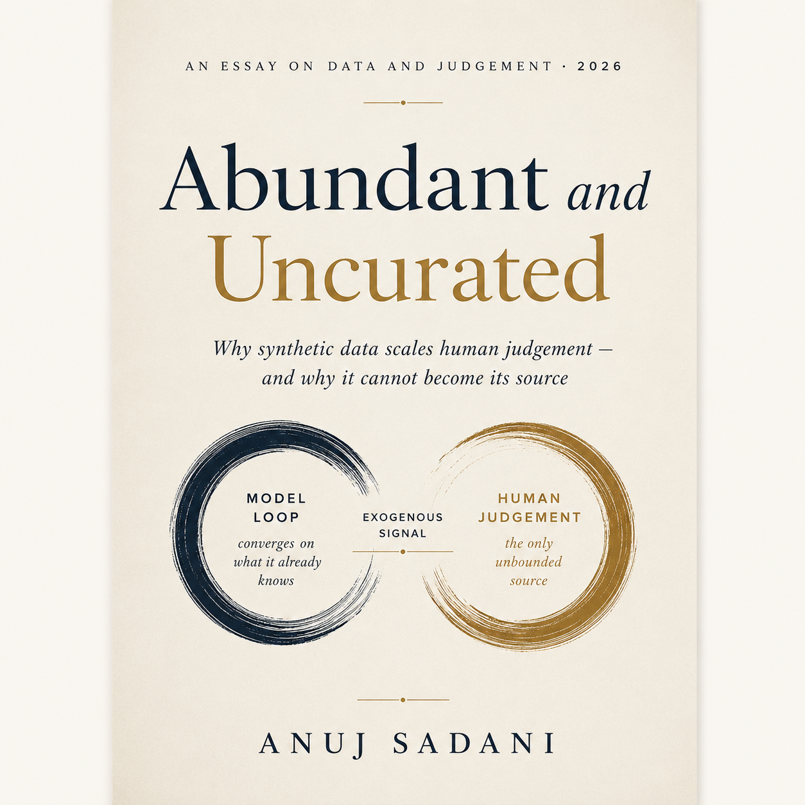

<p align="center">
  
</p>

<h1 align="center">Abundant and Uncurated</h1>

<p align="center"><em>Why synthetic data scales human judgement — and why it cannot become its source.</em></p>

<p align="center">
  <a href="abundant-and-uncurated.html"><strong>Read the full essay (HTML)</strong></a> ·
  <a href="SUMMARY.md">Summary</a> ·
  <a href="https://ko-fi.com/s/000d383639">Typeset PDF, 21pp</a>
</p>

---

Data is abundant; high-quality curated data is not. The usual explanation — curation is
slow and unglamorous, tooling will fix it — is comfortable and wrong in an important way.

The popular case for keeping humans in the loop is that human judgement is better. It
isn't: a language model beat crowd workers on annotation accuracy by ~25 percentage points
at roughly a thirtieth of the cost (PNAS 2023), and strong model judges match human–human
agreement rates (NeurIPS 2023).

The argument that survives rests on two mechanisms, neither about accuracy:

1. **Informational.** A synthetic loop verified by a model converges on that verifier's own
   knowledge centre, and gains plateau or reverse unless the verifier is perfectly
   reliable. A closed loop of models redistributes information rather than creating it.
2. **Structural.** Evaluation criteria cannot be fully specified before a human has looked
   at outputs — *criteria drift* (UIST 2024). Every result showing machines matching humans
   measures against a **fixed rubric**, and the rubric is the part that cannot be fixed in
   advance.

**Conclusion:** machines should absorb the *application* of judgement; humans own the
*formation* of criteria and the supply of signal exogenous to the system.

Held at moderate confidence, and contested — the counter-case (state-of-the-art reasoning
learned with zero human data) is presented in Chapter III rather than managed away.

## What's here

| File | What it is |
|---|---|
| [`abundant-and-uncurated.html`](abundant-and-uncurated.html) | The full essay. Self-contained, screen + print stylesheets. |
| [`SUMMARY.md`](SUMMARY.md) | Condensed argument with the load-bearing numbers. |
| [`data-in-the-ai-age.md`](data-in-the-ai-age.md) | The underlying paper, with `[^c-NNN]` claim markers and generated references. |
| [`.research/`](.research/) | The verification workspace — brief, source ledger, claims ledger, synthesis, gate report. |
| `Abundant_and_Uncurated_cover.png` | Cover art. |

The **typeset 21-page PDF** is available at
[ko-fi.com/s/000d383639](https://ko-fi.com/s/000d383639). The HTML here is the complete
text — the PDF is the print-set artifact.

## How this was built

Every factual claim is bound to an exact quoted passage inside a source captured to disk
and checked by hash. Not to a URL, and not to a recollection of a page.

```
.research/
  brief.md                 question, sub-questions, out-of-scope, known traps
  lens.yaml                source standard (academic; T1–T4 definitions)
  sources.jsonl            27 captured sources, tiered, with caveats
  claims.jsonl             45 claims, each bound to an exact quote + locator
  synthesis.md             agreement, conflict, single-source risk, gaps
  report.md                the paper
  verification-report.md   the gate's verdict
  state.yaml               pipeline state and phase-by-phase record
```

**Counts:** 45 claims, 43 passing and cited, 2 rejected and reported as such.
57 quoted bindings across 27 snapshots, zero mismatches. Gate verdict: **PASS**, 0 hard
failures.

22 distinct works — 9 peer-reviewed, 13 preprints/conference papers, no press coverage,
and **no systematic review with a registered protocol**, so nothing here carries
meta-analytic support.

Built with [research-anything](https://github.com/asadani/research-anything).

### Two claims failed verification

Both are widely repeated, both appear nowhere in the essay, and both are kept in the
ledger rather than quietly dropped:

- *"Golden datasets built from production traces reflect real usage in a way synthetic
  test cases cannot."* The nearest captured source argues the opposite — that real-world
  data is noisy and unbalanced and may overlook rare but critical edge cases.
- *"A layered LLM-annotator / judge / synthetic gap-fill / human-review pipeline is now
  standard practice."* "Standard" is a claim about industry adoption; it would need a
  practitioner survey, and none exists in this corpus.

### Known limits

- **Single-source dependency.** The knowledge-centre bound — the formal basis of
  Chapter II — rests on one preprint, demonstrated at small scale.
- **Domain skew.** The strongest verification evidence is from code, where a compiler
  supplies free ground truth. Generalisation to tone and safety is directional, not
  established.
- **Out of scope by design.** Copyright/licensing, privacy regulation, non-text
  modalities, data-market economics.
- **Unretrieved.** Aroyo & Welty (2015) was paywalled; it is not cited, and the chapter on
  curation cost is weaker for its absence.

## Reproducing the verification

The claims ledger records, for every claim, the source id and the exact quoted substring
it is bound to. `.research/sources.jsonl` records each source's URL and content hash.

**Source snapshots are not included in this repository.** They are captured full text of
third-party copyrighted papers, retained locally for verification but not redistributable
here. To re-run the checks, re-capture the sources from the URLs in `sources.jsonl` and
verify the hashes match.

## Licence

© 2026 Anuj Sadani. Licensed under
**[CC BY-NC-ND 4.0](https://creativecommons.org/licenses/by-nc-nd/4.0/)** — see
[`LICENSE`](LICENSE) for the full legal code.

In short: **read it, quote it, share it — with credit, not for commercial use, and without
redistributing modified versions.** That covers the essay, the summary, and the research
workspace authored here.

It does **not** — and cannot — apply to third-party material. The quoted passages recorded
in `.research/claims.jsonl` are short excerpts from copyrighted works, reproduced for
verification and citation. Rights in those remain with their publishers, and each is
attributed in the essay's Notes & Sources with a tier label and a link to the original.

Quoting the essay in commentary, criticism or scholarship is fair use and needs no
permission from anyone. For anything else — translations, reprints, commercial use —
[get in touch](https://github.com/asadani).
